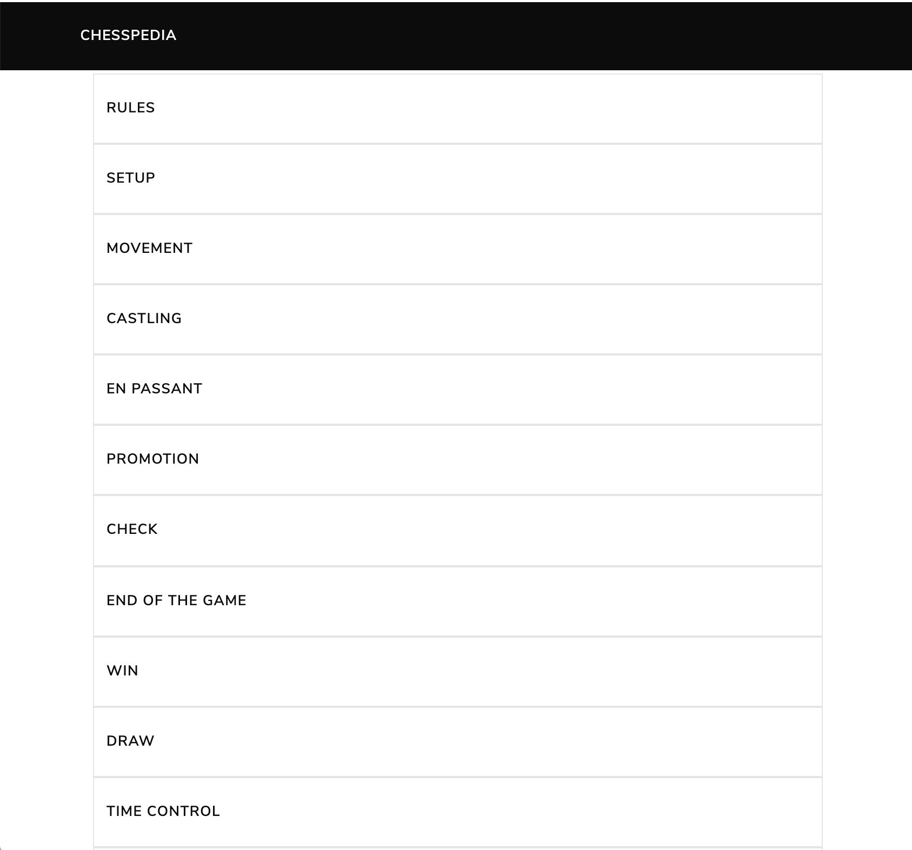
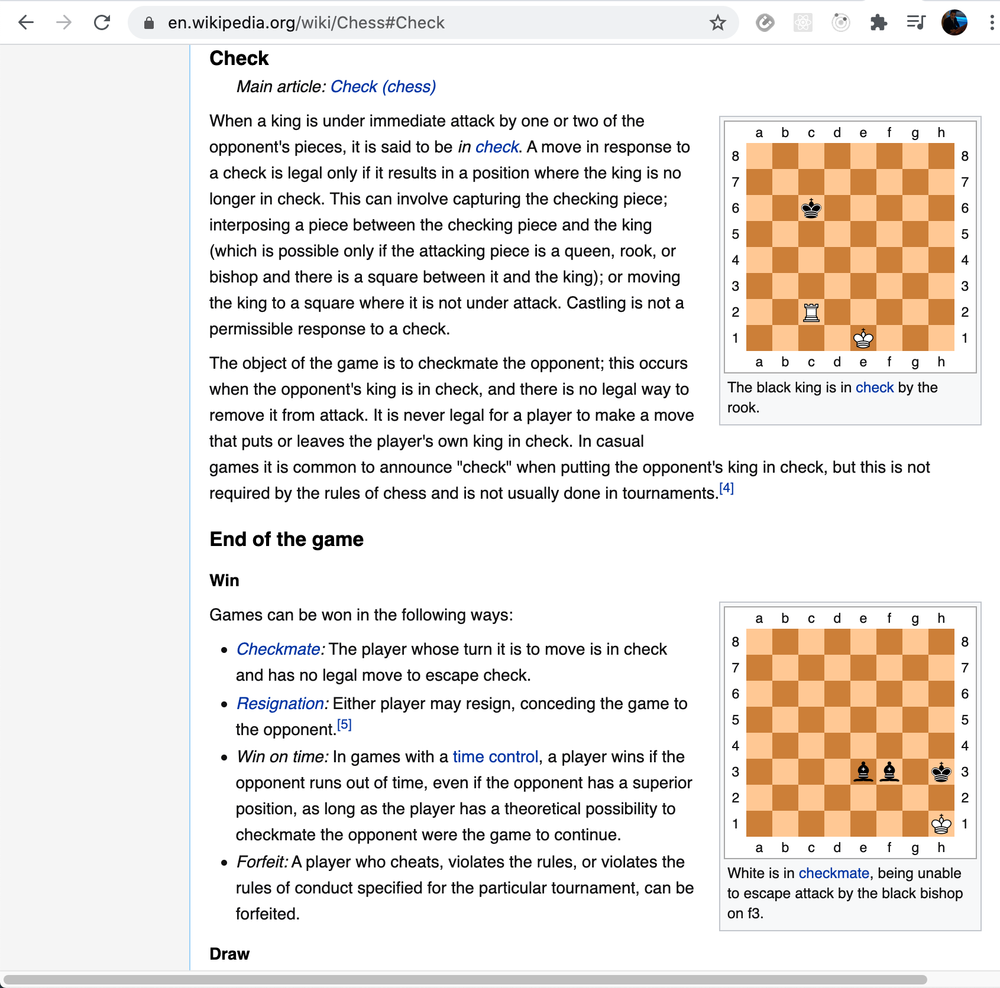

# Chesspedia

Chesspedia is basically a table on contents type of application. Using puppeteer, the application crawls the wiki chess page for all the subheading links. All links in one convinience spot

React, Node, Express, Puppeteer

# Available Scripts

In the project directory, you can run:

# `npm start on /client` and `node server.js on /puppeteer`

<h3>Summary</h3>
Created a server with node and express that crawls the chess wikipedia page and displays the information on the client side using React. I like working with puppeteer and learned a lot how to use it. I wanted to create something that crawls the web and after tinkering around this application was born. I was also inspired by the recently Netflix hit 'The Queen's Gambit'.

<h3>Author</h3>

Roger Alexander - Full Stack Developer <a href="http://www.douschesois.com">Portfolio Website</a>
